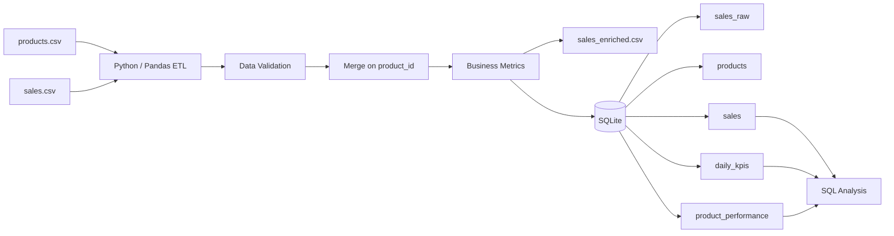

# Restaurant Operations Data Pipeline

An end-to-end data engineering project that simulates a restaurant operations pipeline using Python, Pandas, SQLite and SQL.

The project extracts raw sales and product data from CSV files, validates and transforms the data, calculates business metrics, creates analytical tables, and loads the results into a SQLite database for SQL analysis.

The dataset is synthetic and was generated specifically for this project.

---

## Project Overview

The pipeline processes:

- 1,500 synthetic sales records
- 10 restaurant products
- product categories
- selling prices
- unit food costs
- sales quantities
- transaction dates

The pipeline calculates operational KPIs including:

- Revenue
- Food cost
- Gross profit
- Food cost percentage
- Gross margin percentage
- Daily sales performance
- Product performance

---

## Data Pipeline

```text
Raw CSV files
      |
      v
Extract with Python / Pandas
      |
      v
Data validation
      |
      v
Data cleaning
      |
      v
Merge sales + product data
      |
      v
Calculate business metrics
      |
      v
Create analytical tables
      |
      v
Save processed data
      |
      v
Load into SQLite
      |
      v
      |
      v
SQL analysis
```

## Architecture Diagram


## Example Results

A successful pipeline run processes 1,500 synthetic sales records and produces the following results:

| Metric | Result |
|---|---:|
| Sales records processed | 1,500 |
| Total revenue | 72,930.00 |
| Total gross profit | 52,746.60 |
| Daily KPI records | 90 |
| Product performance records | 10 |

These results are generated from synthetic restaurant sales data created specifically for this project.
